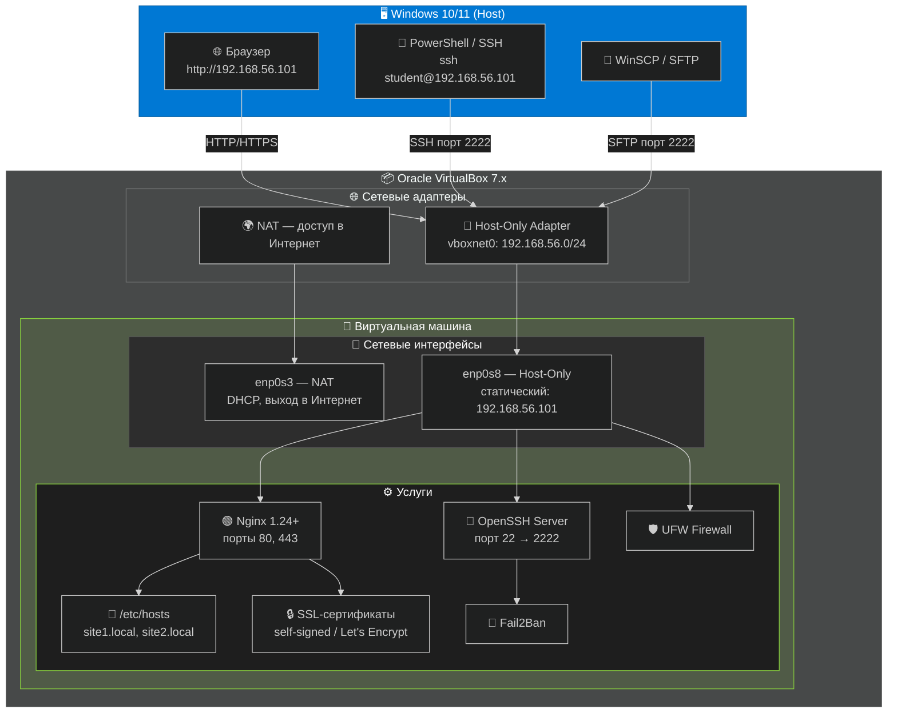
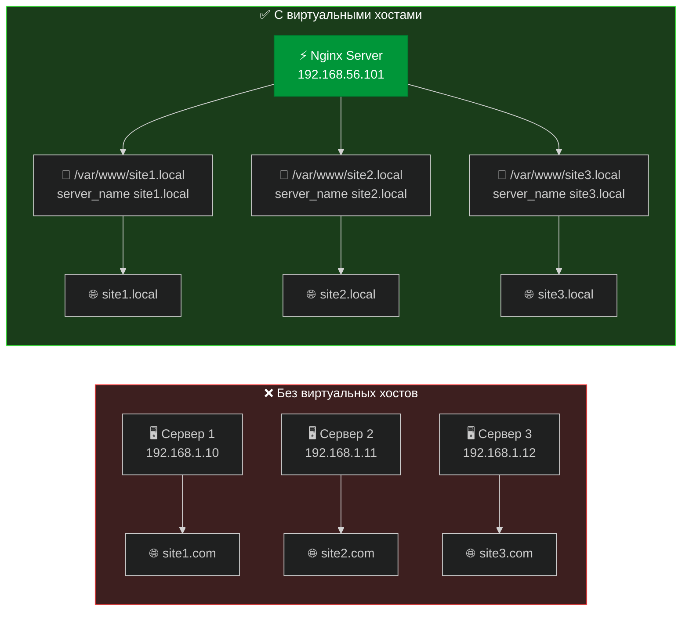
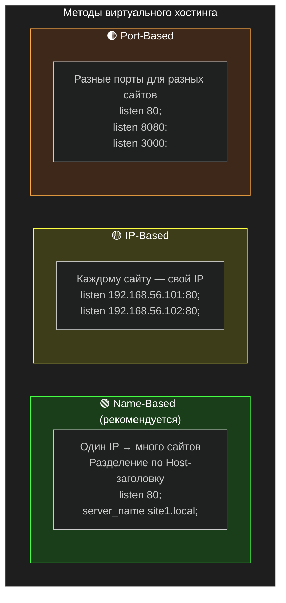
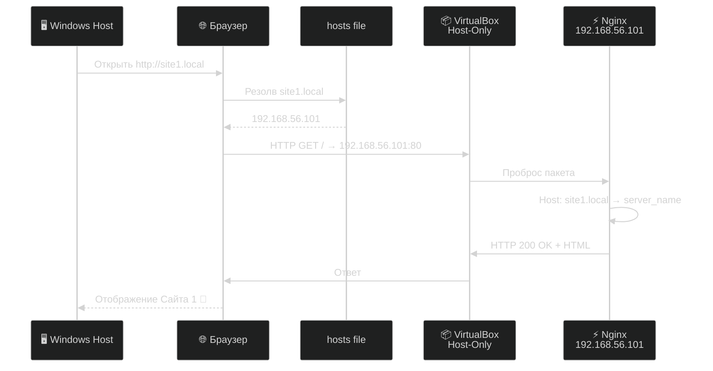
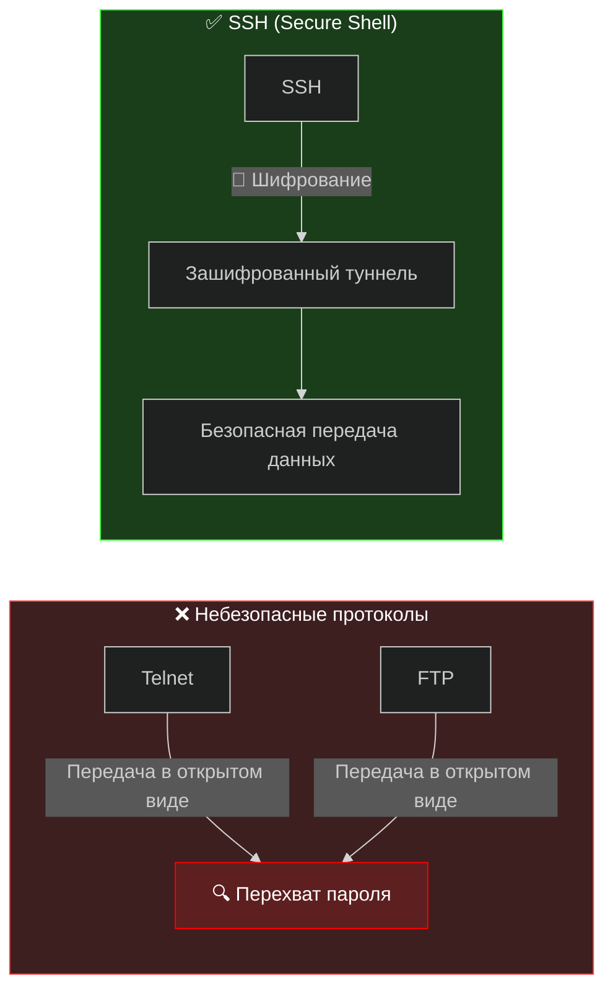
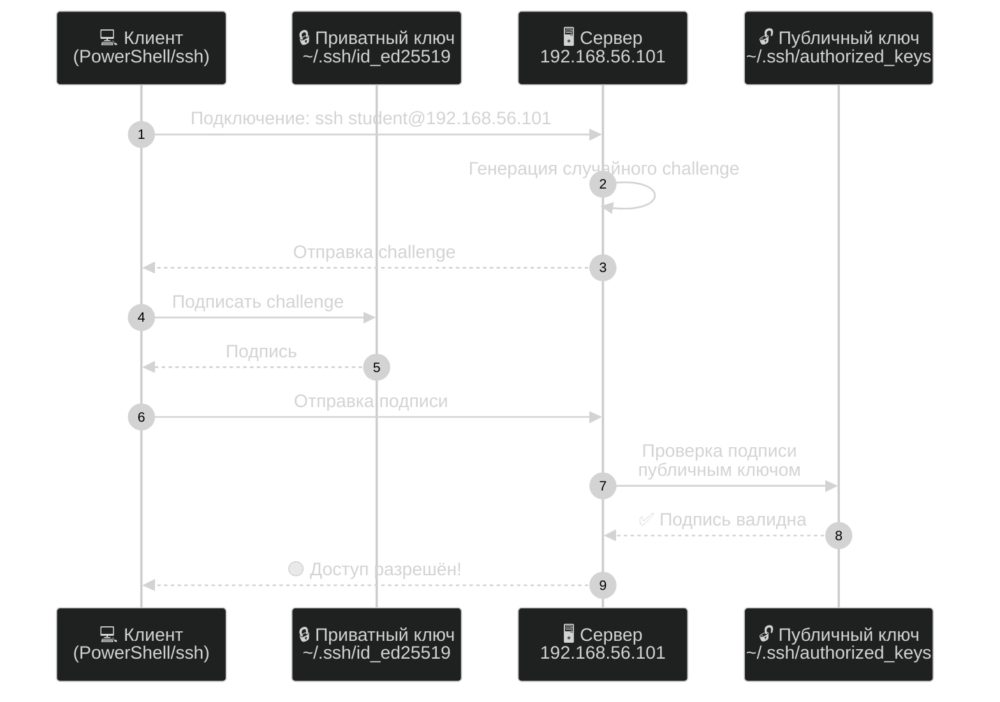
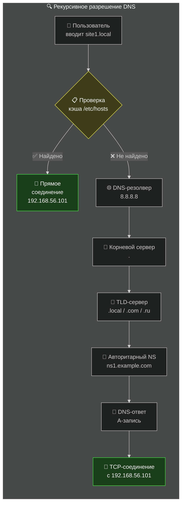
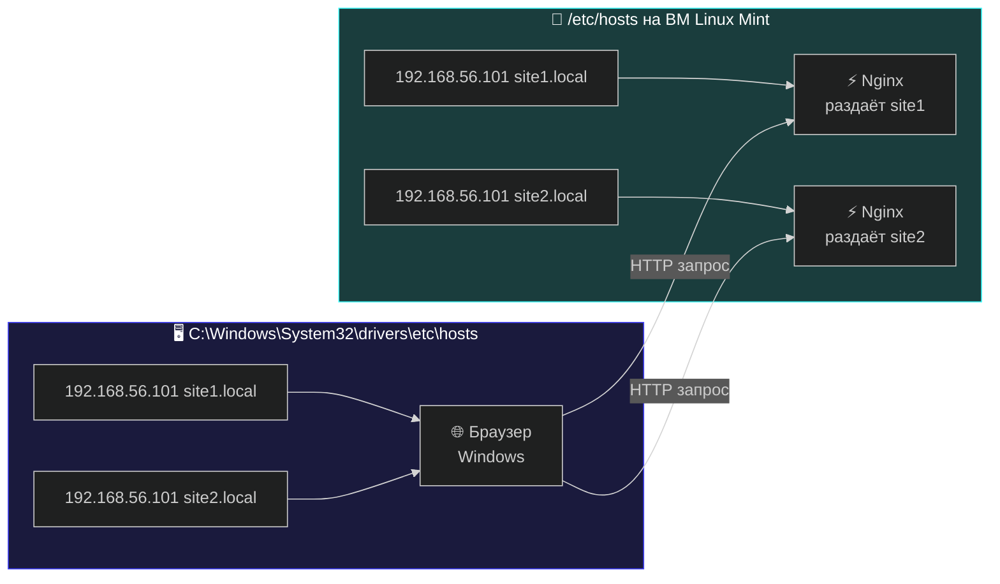
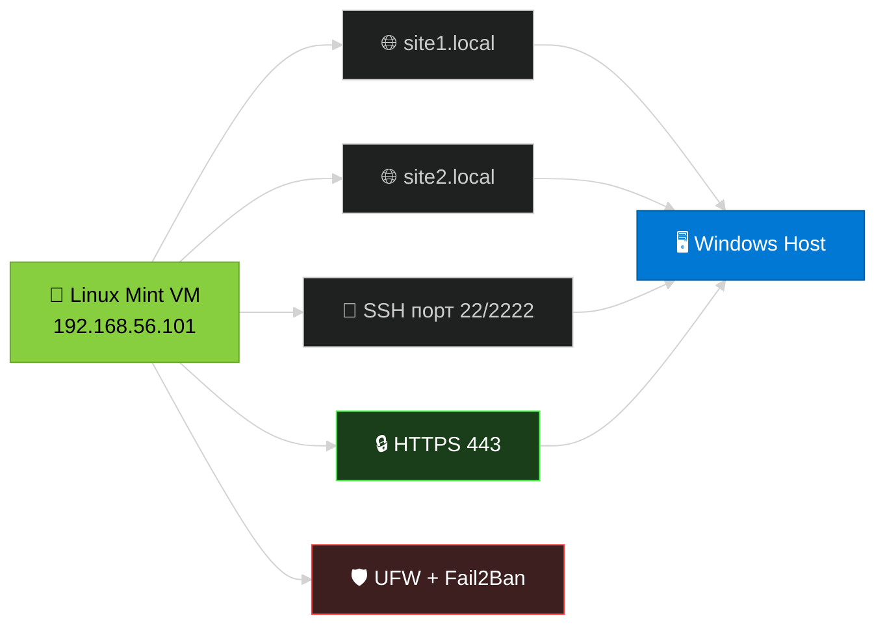

<div align="center">

#  Практическая Работа: Продвинутое Управление Веб-Сервером Nginx


**Дисциплина:** *Сетевые Системы и Приложения*  
**Уровень:** Средний (Intermediate)  
**Предварительные требования:** Лабораторная работа «Установка и базовая настройка Nginx»  
**Год:** 2026

</div>

---

##  Содержание

- [Практическая Работа: Продвинутое Управление Веб-Сервером Nginx](#практическая-работа-продвинутое-управление-веб-сервером-nginx)
  - [Содержание](#содержание)
  - [Общие сведения о стенде](#общие-сведения-о-стенде)
    - [Топология лабораторной среды](#топология-лабораторной-среды)
    - [Предварительная настройка ВМ](#предварительная-настройка-вм)
    - [Проверка готовности стенда](#проверка-готовности-стенда)
  - [Модуль 01. Виртуальные хосты Nginx](#модуль-01-виртуальные-хосты-nginx)
    - [Теория: архитектура виртуального хостинга](#теория-архитектура-виртуального-хостинга)
    - [1.2. Методы виртуального хостинга](#12-методы-виртуального-хостинга)
      - [1.2.1. Виртуальный хостинг на основе доменного имени (Name-Based)](#121-виртуальный-хостинг-на-основе-доменного-имени-name-based)
      - [1.2.2. Виртуальный хостинг на основе IP-адреса (IP-Based)](#122-виртуальный-хостинг-на-основе-ip-адреса-ip-based)
      - [1.2.3. Виртуальный хостинг на основе порта (Port-Based)](#123-виртуальный-хостинг-на-основе-порта-port-based)
    - [Структура конфигурационных файлов Nginx](#структура-конфигурационных-файлов-nginx)
    - [Практикум: настройка Name-Based Virtual Hosts](#практикум-настройка-name-based-virtual-hosts)
      - [Шаг 1.1 — Создание структуры каталогов](#шаг-11--создание-структуры-каталогов)
      - [Шаг 1.2 — Создание HTML-страниц](#шаг-12--создание-html-страниц)
      - [Шаг 1.3 — Конфигурация серверных блоков](#шаг-13--конфигурация-серверных-блоков)
      - [Шаг 1.4 — Активация и тестирование](#шаг-14--активация-и-тестирование)
      - [Шаг 1.5 — Локальное разрешение имён в ВМ](#шаг-15--локальное-разрешение-имён-в-вм)
    - [Проверка из Windows-хоста](#проверка-из-windows-хоста)
  - [Модуль 02. Удалённое управление через SSH](#модуль-02-удалённое-управление-через-ssh)
    - [Теория: протокол SSH и аутентификация по ключам](#теория-протокол-ssh-и-аутентификация-по-ключам)
    - [Практикум: генерация ключей в  PowerShell/ OpenSSH](#практикум-генерация-ключей-в--powershell-openssh)
  - [Модуль 03. Система доменных имён DNS](#модуль-03-система-доменных-имён-dns)
    - [Теория: принципы работы DNS](#теория-принципы-работы-dns)
    - [Практикум: настройка локального DNS в /etc/hosts](#практикум-настройка-локального-dns-в-etchosts)
  - [Поздравляем!](#поздравляем)

---

##  Общие сведения о стенде

### Топология лабораторной среды



### Предварительная настройка ВМ

> **ВАЖНО: Настройка сети выполняется ДО начала работы!**
>
> В Oracle VirtualBox у вашей ВМ Linux Mint 22 должны быть активны **два** сетевых адаптера:

| Адаптер | Тип | Назначение | Настройка |
|---------|-----|-----------|-----------|
| **Adapter 1** | NAT | Доступ в Интернет (обновления, Certbot) | Включён по умолчанию, DHCP |
| **Adapter 2** | Host-Only | Статический IP для доступа с Windows-хоста | Создайте vboxnet0, отключите DHCP |

**Конфигурация статического IP на ВМ (выполнить в терминале Linux Mint):**

```bash
# Просмотр доступных интерфейсов
ip addr show

# Редактирование конфигурации netplan
ls /etc/netplan/
sudo nano /etc/netplan/00-installer-config.yaml
```

Содержимое файла:

```yaml
network:
  version: 2
  ethernets:
    enp0s3:                          # NAT-интерфейс
      dhcp4: true
    enp0s8:                          # Host-Only интерфейс
      dhcp4: false
      addresses:
        - 192.168.56.101/24
      nameservers:
        addresses:
          - 8.8.8.8
          - 8.8.4.4
```

```bash
# Применение конфигурации
sudo netplan apply

# Проверка IP-адресов
ip addr show enp0s8
# Ожидаемый результат: inet 192.168.56.101/24
```

**Проверка связности с Windows:**

```bash
# С ВМ Linux Mint — проверка доступности Windows-хоста
ping -c 4 192.168.56.1
```

> ** ПОДСКАЗКА:** IP `192.168.56.1` — это виртуальный интерфейс VirtualBox на вашем Windows-хосте. Убедитесь, что пинг проходит, прежде чем продолжать.

### Проверка готовности стенда

Выполните в терминале ВМ Linux Mint перед началом основной работы:

```bash
#  1. Версия Nginx (должна быть 1.24+)
nginx -v

#  2. Nginx активен
sudo systemctl status nginx --no-pager

#  3. Sudo-привилегии
sudo whoami    # ожидается: root

#  4. Статический IP корректен
ip addr show enp0s8 | grep "192.168.56.101"

#  5. Доступ в Интернет через NAT
ping -c 3 google.com

#  6. SSH-сервер установлен и работает
sudo systemctl status sshd --no-pager
```

---

## Модуль 01. Виртуальные хосты Nginx

### Теория: архитектура виртуального хостинга

**Проблема:** без виртуальных хостов один сервер = один сайт. Для 5 сайтов требуется 5 серверов — неэффективно и дорого.

**Решение:** виртуальные хосты позволяют размещать неограниченное количество сайтов на одном экземпляре Nginx. Сервер анализирует заголовок `Host` HTTP-запроса и направляет его к нужной конфигурации.


### 1.2. Методы виртуального хостинга

Nginx поддерживает три методологии организации виртуального хостинга:



#### 1.2.1. Виртуальный хостинг на основе доменного имени (Name-Based)

Рекомендуемый метод для большинства сценариев эксплуатации. Механизм использует заголовок `Host` HTTP/1.1 для маршрутизации запросов.

```nginx
server {
    listen 80;
    server_name site1.local;
    root /var/www/site1.local;
}

server {
    listen 80;
    server_name site2.local;
    root /var/www/site2.local;
}
```

| Достоинства | Ограничения |
|-------------|-------------|
| Один IP-адрес обслуживает неограниченное количество сайтов | Требуется поддержка HTTP/1.1 клиентом |
| Экономия IP-адресов | Невозможен для протоколов без передачи заголовка Host (устаревшие системы) |
| Наиболее распространённая конфигурация в производственных средах | — |

#### 1.2.2. Виртуальный хостинг на основе IP-адреса (IP-Based)

Каждому веб-сайту выделяется уникальный IP-адрес. Сервер определяет целевой конфигурационный блок по IP-адресу получателя.

```nginx
server {
    listen 192.168.1.10:80;
    root /var/www/site1.local;
}

server {
    listen 192.168.1.11:80;
    root /var/www/site2.local;
}
```

| Достоинства | Ограничения |
|-------------|-------------|
| Совместимость с любыми протоколами транспортного и прикладного уровней | Необходимость выделения множественных IP-адресов |
| Независимость от версии HTTP | Ограниченность IPv4-пространства |

#### 1.2.3. Виртуальный хостинг на основе порта (Port-Based)

Различные веб-сайты обслуживаются на различных TCP-портах.

```nginx
server {
    listen 80;
    root /var/www/site1.local;
}

server {
    listen 8080;
    root /var/www/site2.local;
}
```

| Достоинства | Ограничения |
|-------------|-------------|
| Простота тестирования и отладки | Непрофессиональное отображение URL (указание порта) |
| Отсутствие требований к доменным именам | Необходимость информирования пользователей о нестандартном порте |


### Структура конфигурационных файлов Nginx

Nginx использует строго регламентированную иерархию каталогов для хранения конфигурационных файлов:

```
/etc/nginx/
├── nginx.conf              # Главный конфигурационный файл
├── sites-available/        # Хранилище всех конфигурационных блоков серверов
│   ├── site1.local         # Конфигурация первого виртуального хоста
│   ├── site2.local         # Конфигурация второго виртуального хоста
│   └── default             # Конфигурация по умолчанию
└── sites-enabled/          # Активные конфигурации (символические ссылки)
    ├── site1.local -> ../sites-available/site1.local
    └── site2.local -> ../sites-available/site2.local
```

> **Академическое примечание:** Использование символических ссылок (symlinks) между каталогами `sites-available/` и `sites-enabled/` является канонической практикой в системах на базе Debian/Ubuntu. Данный подход позволяет активировать и деактивировать виртуальные хосты без физического удаления конфигурационных файлов, что обеспечивает атомарность операций и упрощает процедуры отката изменений.
---

### Практикум: настройка Name-Based Virtual Hosts

> **🎯 Цель:** развернуть два виртуальных хоста `site1.local` и `site2.local` на ВМ с IP `192.168.56.101`, доступных через браузер с Windows-хоста.

#### Шаг 1.1 — Создание структуры каталогов

```bash
# Создаём корневые директории сайтов
sudo mkdir -p /var/www/site1.local /var/www/site2.local

# Назначаем права (замените student на вашего пользователя)
sudo chown -R $USER:$USER /var/www/site1.local /var/www/site2.local

# Устанавливаем права доступа
sudo chmod -R 755 /var/www/site1.local /var/www/site2.local

# Проверяем
ls -la /var/www/
```

#### Шаг 1.2 — Создание HTML-страниц

```bash
# === Сайт 1 ===
cat > /var/www/site1.local/index.html << 'EOF'
<!DOCTYPE html>
<html lang="ru">
<head>
    <meta charset="UTF-8">
    <title>Сайт 1 — Виртуальный хост Nginx</title>
    <style>
        * { margin: 0; padding: 0; box-sizing: border-box; }
        body {
            font-family: 'Segoe UI', Tahoma, Geneva, Verdana, sans-serif;
            background: linear-gradient(135deg, #1a1a2e 0%, #16213e 100%);
            color: #eaeaea;
            min-height: 100vh;
            display: flex;
            flex-direction: column;
            align-items: center;
            justify-content: center;
            text-align: center;
        }
        .container { max-width: 600px; padding: 40px; }
        h1 { font-size: 2.5em; margin-bottom: 20px; color: #e94560; }
        .badge {
            display: inline-block;
            background: #0f3460;
            padding: 10px 20px;
            border-radius: 25px;
            margin: 10px;
            font-size: 0.9em;
        }
        .success { color: #4ecca3; font-size: 1.2em; margin-top: 30px; }
        .ip { color: #f5a623; margin-top: 15px; }
    </style>
</head>
<body>
    <div class="container">
        <h1>🎉 Сайт 1 работает!</h1>
        <span class="badge">Nginx</span>
        <span class="badge">Virtual Host</span>
        <span class="badge">Linux Mint 22</span>
        <p class="success">✅ Первый виртуальный хост успешно сконфигурирован</p>
        <p class="ip">Сервер: 192.168.56.101 | Host-Only Adapter</p>
    </div>
</body>
</html>
EOF

# === Сайт 2 ===
cat > /var/www/site2.local/index.html << 'EOF'
<!DOCTYPE html>
<html lang="ru">
<head>
    <meta charset="UTF-8">
    <title>Сайт 2 — Виртуальный хост Nginx</title>
    <style>
        * { margin: 0; padding: 0; box-sizing: border-box; }
        body {
            font-family: 'Segoe UI', Tahoma, Geneva, Verdana, sans-serif;
            background: linear-gradient(135deg, #0f2027 0%, #203a43 50%, #2c5364 100%);
            color: #eaeaea;
            min-height: 100vh;
            display: flex;
            flex-direction: column;
            align-items: center;
            justify-content: center;
            text-align: center;
        }
        .container { max-width: 600px; padding: 40px; }
        h1 { font-size: 2.5em; margin-bottom: 20px; color: #4ecca3; }
        .badge {
            display: inline-block;
            background: #1a3c40;
            padding: 10px 20px;
            border-radius: 25px;
            margin: 10px;
            font-size: 0.9em;
        }
        .success { color: #f5a623; font-size: 1.2em; margin-top: 30px; }
        .ip { color: #e94560; margin-top: 15px; }
    </style>
</head>
<body>
    <div class="container">
        <h1>🚀 Сайт 2 работает!</h1>
        <span class="badge">Nginx</span>
        <span class="badge">Virtual Host</span>
        <span class="badge">Linux Mint 22</span>
        <p class="success">✅ Второй виртуальный хост успешно сконфигурирован</p>
        <p class="ip">Сервер: 192.168.56.101 | Host-Only Adapter</p>
    </div>
</body>
</html>
EOF
```

#### Шаг 1.3 — Конфигурация серверных блоков

```bash
# Создаём конфиг для site1.local
sudo nano /etc/nginx/sites-available/site1.local
```

Вставьте содержимое:

```nginx
server {
    listen 80;
    listen [::]:80;

    server_name site1.local;
    root /var/www/site1.local;
    index index.html;

    location / {
        try_files $uri $uri/ =404;
    }

    # Логи для отладки
    access_log /var/log/nginx/site1.access.log;
    error_log /var/log/nginx/site1.error.log;
}
```

```bash
# Создаём конфиг для site2.local
sudo nano /etc/nginx/sites-available/site2.local
```

```nginx
server {
    listen 80;
    listen [::]:80;

    server_name site2.local;
    root /var/www/site2.local;
    index index.html;

    location / {
        try_files $uri $uri/ =404;
    }

    access_log /var/log/nginx/site2.access.log;
    error_log /var/log/nginx/site2.error.log;
}
```

#### Шаг 1.4 — Активация и тестирование

```bash
# Активируем через символические ссылки
sudo ln -s /etc/nginx/sites-available/site1.local /etc/nginx/sites-enabled/
sudo ln -s /etc/nginx/sites-available/site2.local /etc/nginx/sites-enabled/

# Удаляем дефолтный хост (чтобы не конфликтовал)
sudo rm -f /etc/nginx/sites-enabled/default

# Проверка синтаксиса — ВСЕГДА перед reload!
sudo nginx -t

# Перезагрузка конфигурации
sudo systemctl reload nginx

# Проверка статуса
sudo systemctl status nginx --no-pager
```

#### Шаг 1.5 — Локальное разрешение имён в ВМ

```bash
# Редактируем файл hosts
sudo nano /etc/hosts
```

Добавьте строки:

```
192.168.56.101    site1.local
192.168.56.101    site2.local
```

Проверка внутри ВМ:

```bash
curl -s http://site1.local | grep "title"
curl -s http://site2.local | grep "title"
```

---

### Проверка из Windows-хоста

> **🪟 Для доступа к сайтам с Windows необходимо добавить записи в файл `hosts` Windows!**

**Путь к файлу hosts в Windows:** `C:\Windows\System32\drivers\etc\hosts`

Откройте Блокнот **от имени Администратора** → Файл → Открыть → вставьте путь выше.

Добавьте строки:

```
192.168.56.101    site1.local
192.168.56.101    site2.local
```

Сохраните (`Ctrl+S`).

**Проверка с Windows:**

```powershell
# В PowerShell или CMD:
ping site1.local
ping site2.local
```

Откройте браузер на Windows:
- 🌐 `http://site1.local` — должен открыться Сайт 1 (красная тема)
- 🌐 `http://site2.local` — должен открыться Сайт 2 (зелёная тема)



> **✅ Результат модуля:** Два виртуальных хоста развёрнуты и доступны через браузер Windows по адресам `http://site1.local` и `http://site2.local`.

---

## Модуль 02. Удалённое управление через SSH

### Теория: протокол SSH и аутентификация по ключам



**Схема аутентификации по ключевой паре:**



**Алгоритмы генерации ключей:**

| Алгоритм | Размер ключа | Безопасность | Рекомендация |
|----------|-------------|--------------|--------------|
| **Ed25519** | 256 бит | Высокая |  **Рекомендуется** — быстрый, современный |
| RSA | 4096 бит | Высокая |  Совместимость со старыми системами |
| ECDSA | 521 бит | Средняя |  Потенциальные проблемы с NSA-куривными |

---

### Практикум: генерация ключей в  PowerShell/ OpenSSH

#### Шаг 2.1 — Генерация ключевой пары на ВМ (Linux-сторона)

```bash
# Создаём директорию .ssh (если нет)
mkdir -p ~/.ssh && chmod 700 ~/.ssh

# Генерация Ed25519 ключа
ssh-keygen -t ed25519 -a 100 -C "student@lab-mint"

# При запросе:
# Enter file: [Enter — по умолчанию ~/.ssh/id_ed25519]
# Enter passphrase: [Введите надёжную passphrase — ОБЯЗАТЕЛЬНО!]
# Confirm passphrase: [Повторите]
```

**Просмотр созданных ключей:**

```bash
ls -la ~/.ssh/
# Должно быть:
# - id_ed25519      (приватный, права 600)
# - id_ed25519.pub  (публичный, права 644)
```

#### Шаг 2.2 — Размещение публичного ключа на сервере

```bash
# Копируем публичный ключ в authorized_keys
cat ~/.ssh/id_ed25519.pub >> ~/.ssh/authorized_keys
chmod 600 ~/.ssh/authorized_keys

# Проверяем содержимое
cat ~/.ssh/authorized_keys
# Должна быть строка, начинающаяся с ssh-ed25519 ...
```


---

## Модуль 03. Система доменных имён DNS

### Теория: принципы работы DNS



**Основные типы DNS-записей:**

| Тип | Назначение | Пример |
|-----|-----------|--------|
| **A** | Домен → IPv4-адрес | `site1.local. IN A 192.168.56.101` |
| **AAAA** | Домен → IPv6-адрес | `site1.local. IN AAAA ::1` |
| **CNAME** | Псевдоним (алиас) | `www.site1.local. IN CNAME site1.local.` |
| **MX** | Почтовый сервер | `site1.local. IN MX 10 mail.site1.local.` |

---

### Практикум: настройка локального DNS в /etc/hosts

В лабораторной среде без полноценного DNS-сервера разрешение имён выполняется через файл `hosts`.



**На ВМ Linux Mint:**

```bash
# Проверка текущего содержимого
cat /etc/hosts

# Добавление записей (если ещё не добавлены в Модуле 01)
sudo tee -a /etc/hosts << 'EOF'
192.168.56.101    site1.local
192.168.56.101    site2.local
EOF

# Проверка
cat /etc/hosts | grep site
```

**На Windows-хосте:**

```powershell
# Открыть Блокнот от имени Администратора → C:\Windows\System32\drivers\etc\hosts
# Добавить:
# 192.168.56.101    site1.local
# 192.168.56.101    site2.local

# Проверка в PowerShell:
ping site1.local
# Ожидается ответ от 192.168.56.101
```

**Диагностика DNS:**

```bash
# В Linux:
getent hosts site1.local
nslookup site1.local
dig site1.local

# Трассировка полного пути
dig +trace google.com
```

> **📚 Теория:** Файл `/etc/hosts` имеет **наивысший приоритет** при разрешении имён (до обращения к DNS). Это управляется файлом `/etc/nsswitch.conf` (строка `hosts: files dns`). Для лабораторной среды это позволяет имитировать полноценную DNS-инфраструктуру.


---

<div align="center">

##  Поздравляем!

Вы успешно развернули полноценный защищённый веб-сервер в лабораторной среде.




---

*Документ подготовлен в рамках учебной дисциплины «Сетевые Системы и Приложения»*  
*Linux Mint 22 • Oracle VirtualBox 7.x • Nginx 1.24+*  
*Последнее обновление: Апрель 2026 г.*

</div>
